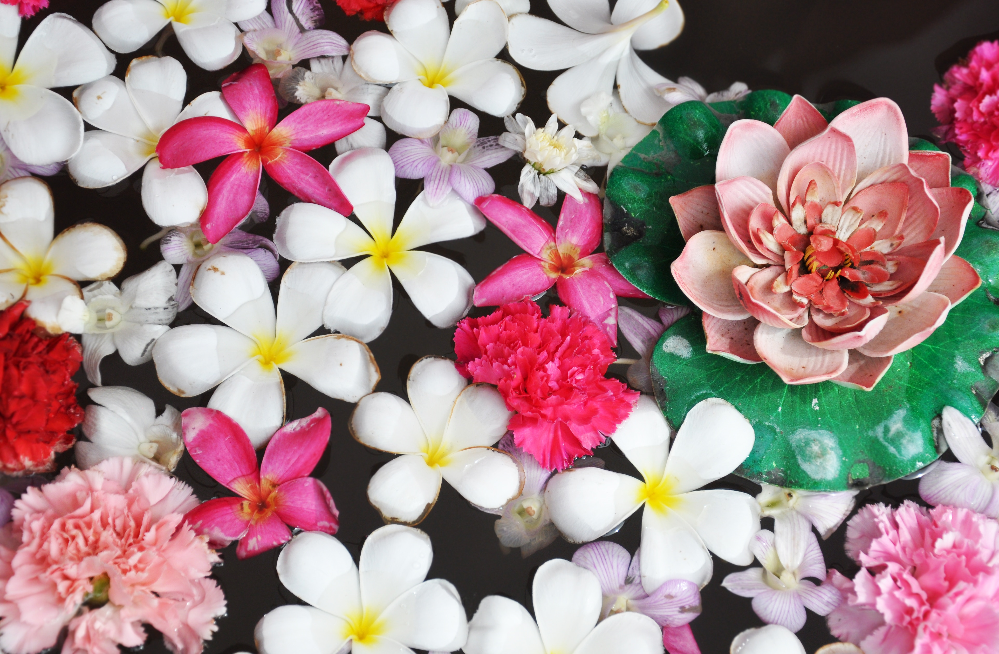
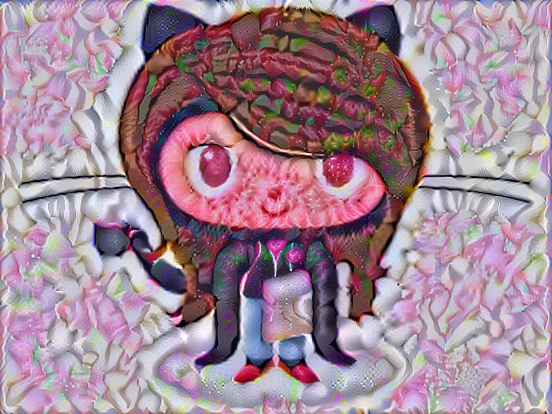

# Styled_image

This an implementation of Neural Style Transfer using Tensorflow.
This algorithm was created by Gatys et al. (2015). The paper is [here](1508.06576.pdf).

## Getting Started

These instructions will get you a copy of the project up and running on your local machine for development and testing purposes. See deployment for notes on how to deploy the project on a live system.

### Dependencies

You will need the following packages:

* [TensorFlow](https://www.tensorflow.org/versions/master/get_started/os_setup.html#download-and-setup)
* [NumPy](https://github.com/numpy/numpy/blob/master/INSTALL.rst.txt)
* [SciPy](https://github.com/scipy/scipy/blob/master/INSTALL.rst.txt)
* [Pillow](http://pillow.readthedocs.io/en/3.3.x/installation.html#installation)
* [Jupyter Notebook](http://jupyter.org/)
* [Pre-trained VGG-19 network](www.vlfeat.org/matconvnet/models/beta16/imagenet-vgg-verydeep-19.mat)

### Installing

You can install Python dependencies using `pip install -r requirements.txt`,
and it should just work. If you want to install the packages manually, follow the above list.
For Jupyter Notebook, install [Anaconda](https://www.anaconda.com/download).
Other dependancies are there in the [nst_utils.py](nst_utils.py) file.

Download the [Pre-trained VGG network](Pretrained_Model_LICENSE.txt) and place it in the [pretrained-model](pretrained-model) folder.I have **not** uploaded the pre-trained VGG model here.

## Running the tests

Replace the [images/image.py](images/image.py) and [images/style.py](images/style.py) by your desired content image and styling image respectively.

Run the notebook and get started!:)

**Note:** I have resized both the original image and the styled image to 600 X 800. Please choose both images greater than or equal to the dimensions specified to get optimum results. Otherwise, change the basewidth, hsize parameters in the notebook and IMAGE_WIDTH, IMAGE_HEIGHT parameters under `class CONFIG` of [nst_utils.py](nst_utils.py)

## Example

### My original image:

### My styling image:

### Output:

## Acknowledgments

* Coursera- Deep Learning specilization courses, Deeplearning.ai by Andrew Ng.
* Tensorflow official website
* Stack-overflow
